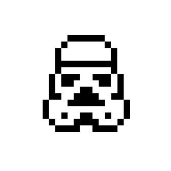

<p align="center">
  
</p>
<h1 align="center"> NFT Colorful Trooper </h1>

<h2> Mint your own NFT collection</h2>


It create a unique Colorful Trooper NFT based on randomly generated colors selected from an handcrafted beautiful palette.
Everything will happen on-chain. This means all the NFT data will live on the blockchain forever.
Colors will be attached to the SVG image and define the Background and the Image itself.

## 🚀 Getting started

1.  **Setup local tooling**
    ```shell
    $ mkdir project-name
    $ cd project-name
    $ npm init -y
    $ npm install --save-dev hardhat
    ```

Now you can install a sample project, running:

```shell
    $ npx harhat
```

Go ahead and install these other dependencies just in case it didn't do it automatically.

```shell
    $ npm install --save-dev @nomiclabs/hardhat-waffle ethereum-waffle chai @nomiclabs/hardhat-ethers ethers
    $ npm install @openzeppelin/contracts
```

2.  **To run the contract locally**

    ```shell
    $ npx hardhat run scripts/run.js
    ```

3.  **To deploy the contract on Ethereum Rinkeby network**

    ```shell
    $ npx hardhat run scripts/deploy.js --network rinkeby
    ```